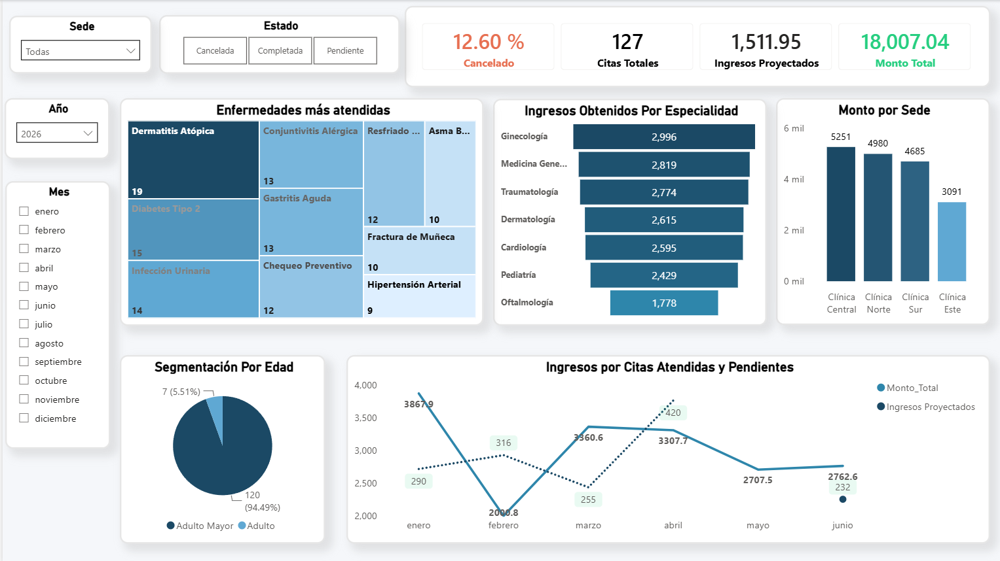

# Dashboard de Análisis Operativo y Financiero - Red de Clínicas Médicas

Este repositorio contiene una solución integral de Inteligencia de Negocios (BI) que abarca desde la estructuración de la infraestructura de datos en el backend hasta el diseño de una interfaz analítica interactiva de nivel corporativo en el frontend.

---

## Arquitectura del Data Warehouse (SQL Server)

El pilar fundamental de este proyecto es la previa construcción y diseño de un **Data Warehouse corporativo** desarrollado en **Microsoft SQL Server** (`ClinicaDB`). Con el fin de aislar la carga transaccional de los sistemas en producción y optimizar la velocidad de respuesta, se estructuró un **Modelo Estrella (Star Schema)** mediante la implementación de vistas analíticas:

* **Tabla de Hechos:** `vFact_CitaMedica` (Centraliza las métricas operativas de volumen de consultas, estados de cita y facturación transaccional).
* **Tablas de Dimensiones:**
    * `vDim_Sede` (Información geográfica e infraestructura de las clínicas).
    * `vDim_Doctor` (Médicos staff y sus respectivas especialidades).
    * `vDim_Paciente` (Información demográfica de los usuarios).
    * `CALENDARIO` (Dimensión temporal limpia para el análisis de tendencias).

*Nota: Todas las llaves subrogadas (Surrogate Keys - SK) fueron debidamente ocultadas en la capa de modelado para garantizar una vista de informe intuitiva y orientada 100% al negocio.*

---

## Vista General del Dashboard (Power BI)

El entregable final fue diseñado en **Power BI Desktop**, implementando contenedores blancos redondeados con sombreado sutil sobre un fondo gris claro, logrando una interfaz de usuario (*UI*) limpia, intuitiva y con aspecto de aplicación web premium.

---

## Objetivos Analíticos Cumplidos

El reporte interactivo cubre al 100% las necesidades operativas y comerciales solicitadas por la gerencia:

1.  **Indicadores Clave de Rendimiento (KPIs Principales):**
    * **Monto Total:** Suma global y transparente de la facturación registrada ($18,007.04).
    * **Citas Totales:** Conteo exacto del volumen analizado (127 citas en el segmento activo).
    * **Tasa de Cancelación:** Porcentaje de citas canceladas calculado mediante DAX avanzado (`KEEPFILTERS` y `ALL`), aislando correctamente las métricas y manteniéndolas dinámicas frente a las interacciones del usuario (12.60%).
    * **Ingresos Proyectados:** Métrica de valor agregado para monitorear los montos financieros en riesgo o en espera debido a citas en estado pendiente.

2.  **Bloques de Análisis Visual:**
    * **Evolución Temporal:** Gráfico de líneas que expone las fluctuaciones mensuales de la facturación real vs. la proyectada para identificar picos de demanda estacionales.
    * **Monto por Sede:** Gráfico de columnas que audita los ingresos de cada clínica ordenados de mayor a menor, identificando a la *Clínica Central* como sede líder.
    * **Ingresos por Especialidad:** Gráfico de embudo con degradado de color automatizado según facturación, destacando las áreas médicas con mayor impacto económico.
    * **Enfermedades más Atendidas:** Un mapa de árbol (*Treemap*) en escala monocromática que agrupa las consultas según el diagnóstico para la correcta planificación de campañas de prevención y stock de farmacia.
    * **Segmentación por Edad:** Gráfico circular de distribución demográfica por `RangoEdad`, revelando que el *Adulto Mayor* representa el público objetivo principal (94.49%).

3.  **Filtros Interactivos Avanzados:**
    * Segmentadores superiores horizontales para conmutación rápida de estados (*Cancelada, Completada, Pendiente*).
    * Filtros dinámicos de jerarquía temporal (*Año* y *Mes*).
    * Menú desplegable para el análisis aislado por *Sede*.

---

## Tecnologías Utilizadas

* **Motor de Base de Datos:** Microsoft SQL Server (Diseño de tablas transaccionales, consultas de transformación DDL/DML y vistas optimizadas).
* **Herramienta de BI:** Power BI Desktop (Conexión al Data Warehouse, modelado de datos dimensional, optimización de tipos de datos de fechas y diseño de interfaz de usuario).
* **Lenguaje DAX:** Desarrollo de medidas dinámicas e inteligentes robustas ante el cruce de filtros cruzados.
